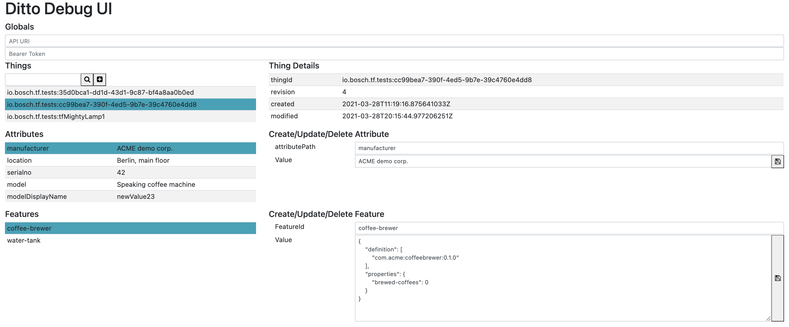
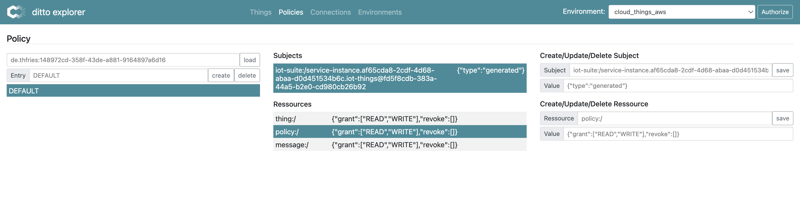
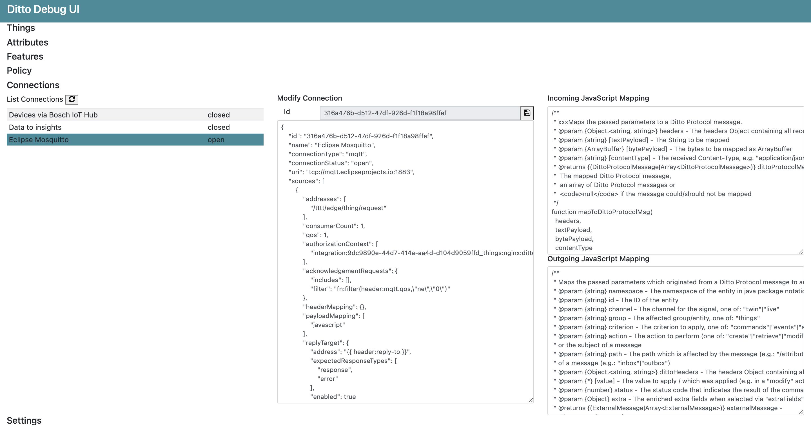

> :exclamation: **This repository is no longer maintained**. It was moved to a fork of the original [Eclipse Ditto repository](https://github.com/eclipse/ditto) and I am happy that the ui was accepted as a pull request there. All features are already available and improved except the WebSocket support (which was only at an early state).

# ditto-ui-bs4
This is an explorer UI for [Eclipse Ditto](https://www.eclipse.org/ditto/). It is implemented with plain HTML and JavaScript using Bootstrap 4 and jQuery. 

## Features
- Search Things
  - Save filters as favorites
  - Configure fields for the search result
  - Pin things to easily access them
- Maintain attributes of things
- Maintain features of things
- Send live messages to features
- Receive messages from single feature
- Maintain policies of things
- Maintain connections
- Supports ditto and Bosch IoT Things APIs

## Frontend screenshots





## Installation
The UI consists only of a static web content. You can:
- Option 1: Copy into your project and change your nginx configuration to serve the files
- Option 2: Check out with [Visual Studio Code](https://code.visualstudio.com) and run the files with the [Live Server](https://marketplace.visualstudio.com/items?itemName=ritwickdey.LiveServer)
- Option 3: Use the docker nginx image, e.g. by
```
docker run -it --rm -d -p 8085:80 --name ditto-ui -v "~/ditto-ui-bs4:/usr/share/nginx/html" nginx
```
- Option ?: what you prefer
 

## Usage
### Initial Setup
Configure your environments:
Go to Environment and edit the json. There are two environments prepared as a sample: one for Ditto and one for Bosch IoT Things

Your environments json is stored in a cookie between sessions.

Choose one of the configured environments in the environment selector.

Use "Authorize" to provide the credentials for the active environment

- For ditto set "useBasicAuth" to true and set a *usernamePassword* separated by a colon ("username:password"). For managing connections [ditto DevOps commands](https://www.eclipse.org/ditto/installation-operating.html#devops-commands) are being used. The default ditto configuration uses a separate user for that, so you can specify *usernamePasswordDevOps* that is used on the Connection tabs if set.
- For Bosch IoT Things set "useBasicAuth" to false and set a Bearer token for your OAuth2 client and (for managing connections) your solution Id

Note: Additional settings will be stored in the environment configuration, like the favorite search filters, the search fields and the pinned things.

### Things view

Enter thingId or thing search filter into the searchfield to load things

Toggle favorite for search filter to store the filter for later use

Pin things in the table to easily access them later. Click "pinned" to get all your pinned things

Navigate through things and features

## Open Issues

- WoT support (and unify and optimize the creation of new objects)
- Templates for connections
- Extend WebSocket support (listen to multiple features and things)
- Add column names for fields and show a header in the things table
- Remove jquery dependency (and upgrade to latest Bootstrap)
- Automated tests
- Treatment for Namespaces
- Get/Refresh bearer token
- Find a better solution for user assertiongs (e.g. "no ting selected" errors)
- ...?

## Main Dependencies
The UI uses
- [Bootstrap 4](https://getbootstrap.com)
- [jQuery](https://jquery.com)
- [Ace Editor](https://ace.c9.io) for editing json and java script
- [JSONPath-Plus](https://github.com/JSONPath-Plus/JSONPath) for managing the search fields
